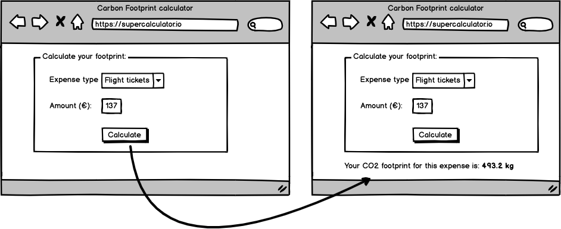

# Kelvin backend technical test

> **Important**: if you haven't been in touch with one of our recruiters yet, you can still make this test and say hi to jobs@kelvin.eco

## Context

One of our clients is really interested in our carbon footprint calculation technology. To get an idea of what we could offer to them, we've decided to build a simple prototype.

## The app

### What you will develop

The app itself is quite simple. For a certain type and amount of expense, you can get its carbon footprint.

#### 1. The frontend

The frontend part consists of one single page containing a form with two fields to select an expense type and type its amount.

When the form is validated, you display the carbon footprint of the expense.

#### 2. The backend

We want to show our client that we are able to make administration interfaces. We want them to be able to _list_, _add_, _edit_ and _delete_ any expense type and its associated carbon footprint ratio.
For the sake of simplicity, this administration interface **does not have to be protected**.

### Data

We have these following data to put into the database. Ratio gives you the amount of CO2 per euro spent in its associated expense type (ie: 1 euro spent for a regular flight ticket means a carbon footprint of 3600 grams).

Expense type | Ratio (carbon footprint per Euro spent)
------------ | -------------
Low-cost flight ticket | 10000
Regular flight ticket | 3600
Electricity | 6000
Legal advice | 160
Car gas|3200
...|...

(Feel free to add more dummy data, these rows are just a suggestion of pseudo-realistic data!)

## Your mission

Develop the dynamic parts of the app using PHP and MySQL. You are free to use any tools that you'd like or none at all. Do your best!

## What will be evaluated?

* The technical choices you have made considering the context of this application
* The quality of your code: syntax, algorithms, architecture, documentation,...