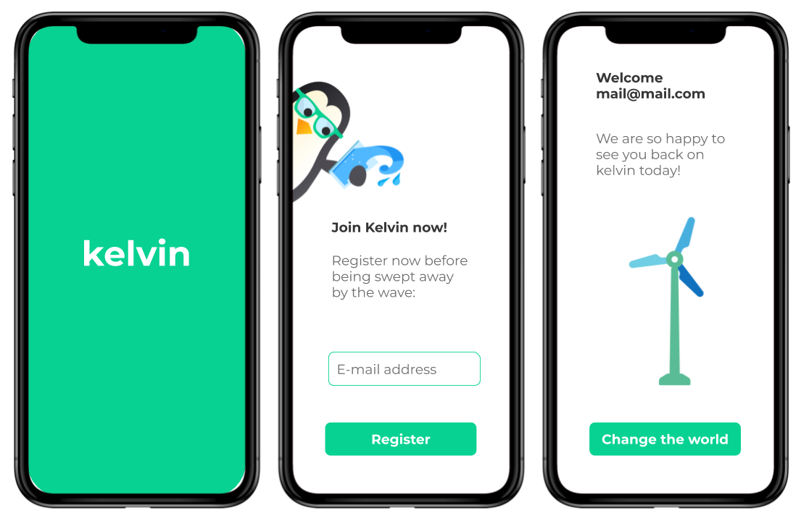

# Kelvin frontend technical test

> **Important**: if you haven't been in touch with one of our recruiters yet, you can still make this test and say hi to jobs@kelvin.eco

## Context

We would like to work on a new version of Kelvin app and your goal is to make an interactive prototype of what it would look like.

## The app

The app is quite simple and consists of three screens like below:

### The screens

* The first screen is displayed while the app is loading (SplashScreen)
* On the second screen, we offer the user to "register" with an e-mail address.
* On the third one, a welcome message with the user's e-mail is displayed as well as a [Lottie](https://airbnb.design/lottie/) animation and a button.

### The logic

* As long as the user is not "registered", the app should display screen 1 & 2.
* If the user is "registered", the app should display screens 1 & 3.
* The button "Change the world" must open the website hellokelvin.com in the browser.
* The app should display properly on phones with a resolution >= to iPhone 8.

## Some hints

* The app should be based on the "bare workflow" meaning using React Native **without Expo**.
* The UX/UI designer may have forgotten some details, feel free to enhance the interface if you need
* Feel free to use any dependency

## Graphical elements

* Graphics are available in this repo
* The font used is Montserrat
* The animation is available here: <https://lottiefiles.com/21328-wind-mill>
